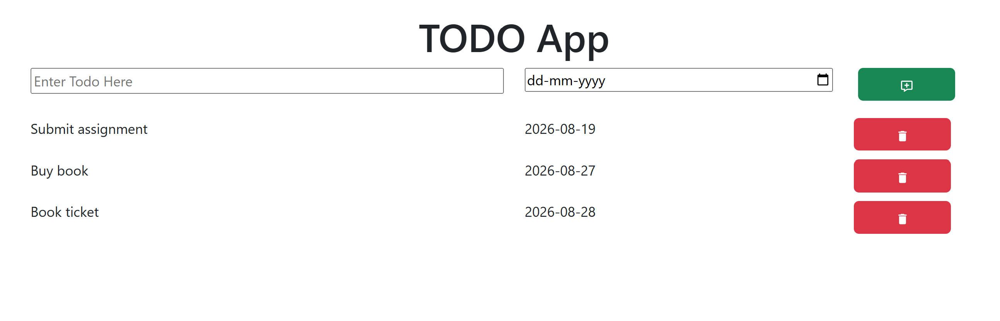

# 📝 Todo App

A simple and interactive **Todo application** built using **React**. This project helps users manage their daily tasks by adding tasks with due dates and removing them when they are completed.

This version is optimized using React's **`useRef` Hook** to directly access and manage input fields without storing their values in component state.

## 📸 Project Screenshot



## 🚀 Features

* ➕ Add new tasks
* 📅 Add a due date for each task
* 🗑️ Delete completed or unwanted tasks
* 👋 Displays a welcome message when there are no tasks
* ⚛️ Built using reusable React components
* 🔄 Dynamic task management using React state
* ⚡ Optimized input handling using the `useRef` Hook

## 🛠️ Technologies Used

* **React**
* **JavaScript**
* **CSS**
* **Bootstrap**
* **React Icons**
* **Vite**

## ⚙️ How It Works

The application uses different reusable components to keep the code organized:

* **AppName** – Displays the application title.
* **AddTodo** – Allows users to enter a task and its due date.
* **TodoItems** – Displays all the added tasks.
* **TodoItem** – Represents an individual todo item.
* **WelcomeMessage** – Displays a message when there are no tasks.

### 🚀 `useRef` Optimization

In this version, the **`useRef` Hook** is used to access the todo input and date input directly.

This helps avoid unnecessary state updates while typing. After a task is added, the input fields are cleared using their references.

## 📦 Getting Started

### Clone the repository

```bash
git clone https://github.com/HasibulAnsari/YOUR-REPOSITORY-NAME.git
```

### Navigate to the project folder

```bash
cd YOUR-REPOSITORY-NAME
```

### Install dependencies

```bash
npm install
```

### Run the application

```bash
npm run dev
```

The application will be available at the local URL shown in your terminal.

## 📚 What I Learned

* Creating reusable React components
* Managing application data using the `useState` Hook
* Optimizing form input handling using the `useRef` Hook
* Passing data and functions through props
* Handling user interactions and events
* Adding and deleting items dynamically
* Using functional state updates
* Working with React and Vite

## 👨‍💻 Author

**Hasibul Ansari**
